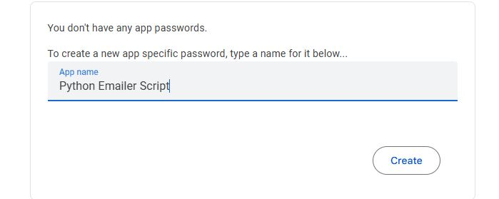

# Automating Emails with Python: Bypassing Gmail's 2FA Using App Passwords 

## Introduction
Tutorials published until this year, on *Automating emails with Python* generally deferred to Google's **Less Secure Apps** feature to prevent authentication errors when interacting with Gmail's SMTP server on the backend.

But as of March 14, 2025, [Google](https://support.google.com/a/answer/14114704?hl=en) officially disabled the LSA feature for all Google accounts to reduce security risks. 
Developers seeking to automate emails with Python must now import libraries like `google-auth` to integrate Google APIs (including Gmail) or use the **App Passwords** feature. 

This tutorial describes how to use the App Passwords feature for email automation. 

## Limitations
This tutorial does not include details on:
* Personalized emails
* Bulk email sending
* HTML emails with attachments
* Handling email replies

## Prerequisites
To follow this tutorial, you need the following:
* Python 3.11.9 or greater
* Basic knowledge of Python's email-sending module (`smtplib`)
* A throwaway Gmail account with 2-step verification turned on

## Understanding Gmail App Passwords
An app password is a 16-character code that grants less secure apps or devices access to a Google account. It is automatically generated when a user lists a new app or device in their Security Settings. 

App passwords are only available for accounts with 2-step verification enabled. Google advises against using them, unless the app or client lacks a *Sign in with Google* option.

### Setting Up Gmail for App Passwords
1. Go to [myaccount.google.com/apppasswords](https://myaccount.google.com/apppasswords).
2. You may need to sign in to your Gmail account. 
3. Enter the app/script name and click **Generate**. The app name doesn't have to match your Python file name.

**Example:**



4. Copy the 16-digit password and paste it into your script.


### Writing the Code
#### Step 1: Install the necessary Python libraries
```python
import smtplib                          #for sending emails via SMTP
from email.mime.text import MIMEText    #for plain-text email content
import datetime                         #for working with date and time
#import MIMEMultipart if you intend to include attachments or web content in the email
```

#### Step 2: Assign the email content to a string variable
```python
msg = """
Welcome, Hacka!

We're excited to welcome you to Hacka-X, where mad science meets creativity.
Add us to your 'Favorites' folder and stay tuned!

Yours in kinship,
- HX Team
"""

```
Note that the email message takes a different format if you intend to include clickable links and formatted text (e.g., **Bold text**, *italics*, etc.)

#### Step 3: List the parameters required for email authentication and dispatch
This is where the 16-character app password you copied earlier comes in.
```python
server = 'smtp.gmail.com'                   #the SMTP server for Gmail
port = 465                                  #SSL port
sender = 'youremail@gmail.com'              #your from email id
password = 'xxxxxxxxxxxxxxxx'               #your app password
recipient = recipient@gmail.com                    #recipient's email address

content = MIMEText(msg, "plain")
content["From"] = sender
content["To"] = recipient
content["Subject"] = "Welcome to Hacka-X!"

```
* `MIMEText` takes 2 arguments:
  *   the email content (`msg`)
  *   the content subtype (plain/html), which tells the email client how to interpret the message
  *   `plain` specifies that the email content is in plain text

#### Step 4: Sending the email securely with error handling
```python
try:
    with smtplib.SMTP_SSL(server, port) as smtp:
        smtp.login(sender, password)
        smtp.sendmail(sender, recipient, content.as_string())
    print(f"Email sent to {recipient}")
except Exception as e:
    print(f"Error sending email to {recipient}: {e}")
```
* `smtplib.SMTP_SSL` connects over SSL immediately, meaning that the entire session in encrypted from the beginning.
  *   It is usually used with Port 465.
  *   If you want to connect on Port 587, use `smtplib.SMTP`, then call `ehlo` and `starttls`.

**Example:**
```python
with smtplib.SMTP(server, port) as smtp:
    smtp.ehlo()           # Introduces client to the server
    smtp.starttls()       # Upgrades the connection to secure TLS
    smtp.ehlo()           # Re-identify after starting TLS
    smtp.login(sender, password)
    smtp.sendmail(sender, recipient, content.as_string())
```

#### Step 5: Confirmation
The `try...except` block provides feedback by printing the email status to your terminal. 
If an error occurs (such as a coding issue or SSL connection failure), you'll see an error message. 
Use the displayed information to refactor your code as needed.


### FAQs
1. Why can't I use my regular Gmail password for automating emails via Python?

Since the deprecation of the *Less Secure Apps* feature, Google no longer supports direct login from scripts. You must use an app password tailored to your program, or OAuth 2.0 to access the Gmail API.
   
2. What if I lose my app password?

You can create another app password for your script, by going to [myaccount.google.com/appasswords](https://myaccount.google.com/apppasswords).
 
3. Is using an app password safe?

Using an app password is safer than storing your Gmail password in scripts. You can delete it and create another at anytime without affecting your main password.


